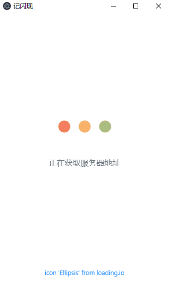
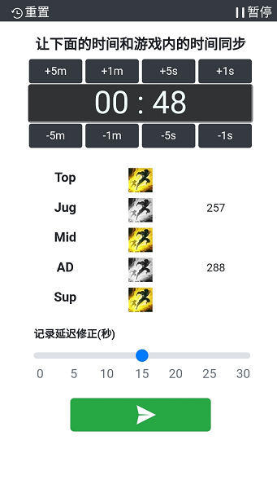
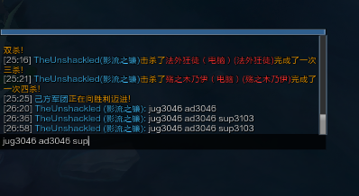

# 概述
记录对手的闪现时间，并一键发送Doinb风格的记录到游戏聊天（类似“mid1230 sup1504”）。

Record your opponents' Flash CD and automatically type the Doinb-style-string (e.g. "mid1230 sup1504") into game chat. 

# 下载 Download
Windows客户端请移步[Release页面](https://github.com/Knkajfw/PasteLikeDoinb/releases)下载zip包。
应用已上架Windows应用商店，也可[点此](https://www.microsoft.com/store/apps/9NTFQT7XWQW7)前往安装。

Head over to [Release Page](https://github.com/Knkajfw/PasteLikeDoinb/releases) to download the Windows client.
The app has also been submitted to Windows Store. Install it [here](https://www.microsoft.com/store/apps/9NTFQT7XWQW7).

# 截图 Screenshots
#### PC端截图
在运行英雄联盟游戏的PC上驻留后台，负责接收指令，将记录语句发送到游戏聊天里。

 

#### 移动端截图
用手机或别的设备扫码访问指定的页面，在此处记录对手何时使用了闪现，查看cd情况，指示发送记录语句。

#### 游戏内截图
游戏内效果

# FAQ
#### Windows商店下载慢？
1.商店抽风，过会再试试吧。
2.在下载页面能看到一个“了解更多有关快速下载”的链接，点击之后，打开“允许从Internet上的其他计算机下载”开关。

#### 打出来的消息是乱码？
记得把输入法调整到英文模式或者使用ENG键盘哦。

#### 安装包体积怎么有60多M？
图省事，JS写完用electron框架适配Windows，安装包体积大是通病了..

#### 安装完了但是找不到打开的方式？
Win键+S打开全局搜索，搜索“记闪现”。

#### 源码在哪？
源码仓库pastelikedoinb-client，为了优化搜索结果，暂时设置了private。需要查看的话请联系我。

# 声明 Disclaim
#### 使用本程序不会危及账号安全
首先，使用本程序时，玩家们对于对手闪现时间的记录完全是手动的，不涉及任何如自动探测，自动记录等影响游戏平衡的功能，不属于外挂或脚本；

其次，本程序不读取/修改任何游戏数据或者游戏文件，不与游戏程序进行直接交互，游戏内聊天的自动键入通过Windows键盘事件API的方式实现，与正常的键盘操作没有区别。

本程序完全符合Riot和腾讯对于第三方程序的要求，使用本程序不会导致账号被封禁。

#### 使用本程序需要授权管理员权限
请知悉，程序需要以管理员权限来运行以向《英雄联盟》的游戏内聊天自动输入内容。如果你没有所使用设备的管理员权限，则很可能无法正常使用本程序。

管理员权限仅供实现上述功能，本程序无任何恶意行为，并已通过微软应用商店审核。详见商店详情页的隐私政策。

[点此直接查看](https://Knkajfw.github.io/paste-like-doinb/PrivacyPolicy.html)